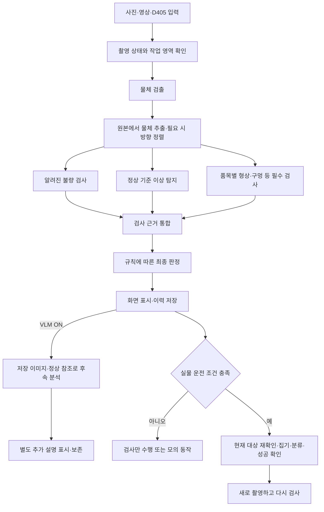

# MES Vision 시스템 설계

작성일: 2026-09-05 · 설계 버전: 0.13 · 상태: 하드웨어 준비 전 소프트웨어 기준 설계

이 문서는 앞으로 구현할 구조다. 문서에 있는 기능이 이미 구현되거나 실제 검사 성능이 검증되었다는 뜻은 아니다. 구현 현황은 DEVELOPMENT_PLAN.md를 따른다.

## 1. 제품 범위와 확정 조건

- 목적: 지정된 제품의 상면 외관 검사 결과와 근거를 표시하고 Dobot Magician으로 분류하는 판매용 시스템.
- 사용자가 검사면을 반드시 위로 놓는다. 로봇 뒤집기는 범위에 포함하지 않는다.
- 고정 상단 D405를 사용한다. 최초 설계는 2D 영상 검사이며 깊이 사용은 필수가 아니다.
- 공급 조건: 물체끼리 겹치지 않고, 검사면과 집기 영역이 가려지지 않아야 한다. 허용 배치 범위는 현장에서 확정한다.
- 상면에서 관찰할 수 없는 내부·바닥·측면 결함의 합격 여부를 추정하지 않는다.
- 개발 및 학습: Ryzen 5900X / RAM 32GB / RTX 3090. 최종 실행 검증: RTX 5070 노트북.
- 외부 유료 AI API 없이 로컬 실행을 기본으로 한다. 코드와 정확한 가중치, 배포 의존성의 상업 배포 조건은 별도로 확인한다.
- 현재 실물·최종 촬영 환경·로봇이 준비되지 않았다. 사용자가 준비 완료를 알릴 때까지 현장 의존 항목은 대기한다.

## 1.1 설치형 프로그램 구성

- 사용자 확정: Windows 설치형 데스크톱 프로그램으로 제공한다. 브라우저 접속을 필수 실행 방식으로 사용하지 않는다.
- 화면은 PySide6, 검사 엔진은 Python으로 구성한다. PySide6-Essentials/shiboken6 6.11.2의 QtCore·QtGui·QtWidgets를 사용하며 Windows 창 실행을 확인했다. 최종 배포 파일 검토는 16 단계에 진행한다.
- 사용자 추가 확정: PySide6 제품 완성 후 WinForms 버전을 별도로 추가한다. Python 검사·판정·저장·VLM 엔진을 재사용할 수 있도록 업무 로직을 Qt 위젯에 넣지 않고 명령·결과 인터페이스로 분리한다. WinForms 구현과 통신·배포 검증은 후속 작업이다.
- 긴 GPU 추론과 장비 통신은 UI 이벤트 처리를 막지 않도록 작업 실행부와 분리한다. 명령·결과·진행 상태는 명시적인 인터페이스로 전달한다.
- 화면: 검사, 품목 설정, 장비 설정·좌표 보정, 검사 이력. 실제 운전과 모의 실행을 구분해 표시한다.
- 프로그램 시작·종료, 실행 중복 방지, 모델 로딩 실패, 장비 연결 해제 및 종료 시 동작 처리까지 구현 범위에 포함한다.
- 설치형 선택이 검사 성능이나 로봇 정지 기능을 보장하지는 않는다. 해당 기능은 별도로 구현·검증한다.
- 라이선스 검토에는 PySide6와 배포할 Qt 모듈, 포장·설치 도구를 포함한다. 라이브러리 사용 조건을 확인하기 전 상업 배포 검토 완료로 표시하지 않는다.
- 추후 웹으로 이력을 조회할 수 있도록 검사 엔진과 저장 구조를 UI에 종속시키지 않는다. 웹 조회 화면 자체는 현재 구현 범위가 아니다.

## 2. 처리 흐름

- 화면 전체를 검출 모델 입력 크기로 줄이더라도, 검사 이미지의 출처는 원본 영상이다. 검출용 축소 영상에서 결함 이미지를 잘라 쓰지 않는다.
- 검출된 모든 검사 대상에 알려진 불량 검사와 이상 탐지를 수행한다. 검출 점수나 기존 분류의 OK를 근거로 이상 탐지를 생략하지 않는다.
- 이상 탐지에는 정상 샘플의 다양한 허용 변동을 반영한다. 이상 점수는 불량 확률과 같지 않다.
- 방향 정렬이 필요 없는 대칭 제품에는 불필요한 정렬을 강제하지 않는다. 정렬 실패가 필수 검사에 영향을 주면 보류한다.
- 검출 상자 중심은 집기 위치와 동일하지 않다. 집기점은 품목별 집기 정책에서 별도로 계산한다.
- 검출되지 않은 물체는 후속 모델도 검사하지 못한다. 예상 수량, 잔여 물체 확인 등 누락 확인 정책과 검출 누락률 검증을 별도로 둔다. 검출 결과가 0개라는 이유만으로 작업대가 비었다고 단정하지 않는다.

## 3. 모듈 경계

| 모듈 | 책임 | 주요 출력 |
|---|---|---|
| 입력 | 파일·영상·카메라 입력을 공통 형식으로 제공 | 프레임 ID, 읽은 시각·촬영 시각·영상 시각 구분, 원본 RGB 영상, 입력 종류 |
| 촬영 품질 | 작업 영역, 가림, 흔들림·노출 등 품목별 필수 조건 확인 | 검사 가능 여부, 실패 사유 |
| 물체 검출 | 제품 위치·종류 검출 | 원본 픽셀 좌표 상자, 검출 점수, 임시 물체 ID |
| 이미지 추출 | 여백을 포함한 원본 이미지 추출, 필요 시 배경 제외·정렬 | 검사 이미지, 원본으로 되돌리는 변환 정보 |
| 알려진 불량 검사 | 지정 불량 검사, 복수 결함 지원 | 불량 코드 목록, 점수, 가능한 경우 근거 영역 |
| 이상 탐지 | 정상 기준으로부터의 이탈 탐색 | 이상 점수, 이상 영역, 적용 기준 버전 |
| 품목별 검사 | 구멍 개수·외곽 등 명시된 검사 수행 | 항목별 합격·불합격·실패, 측정값과 단위 |
| VLM | 저장 이미지·정상 참조·기준으로 선택형 후속 분석 | 관찰 설명, 추가 검토 의견, 제한 사항; 기본 판정 변경 권한 없음 |
| 판정 | 검사 완료 여부와 고정 규칙을 적용 | OK / NG / REVIEW, 사유, 규칙 버전 |
| 로봇 | 현재 대상에 대해 허용된 집기·분류 수행 | 명령 ID, 진행 상태, 성공·실패·확인 불가 |
| 저장 | 이미지와 검사·동작 기록의 연결 보존 | 검사 이력, 오류 이력, 추적 가능한 파일 |
| UI | 장비 상태·검사 근거·설정·운전 상태 표시 | 사용자 조작 요청; 자체적으로 모델 호출·판정하지 않음 |

알려진 불량 검사는 복수 결함을 표현할 수 있어야 한다. 검출 모델에 OK/NG 일곱 개의 상호 배타적 클래스만 두는 구조에 시스템 전체를 종속시키지 않는다. 검사 코드의 종류와 실제 모델 출력은 어댑터에서 연결한다.

## 4. 모델 선택 상태

| 역할 | 현재 방향 | 확정 수준 |
|---|---|---|
| 물체 검출 | 기존 RF-DETR Small 사용 | 일반 사전학습 가중치와 GPU 실행 확인 완료. 실제 제품 학습은 미완료 |
| 알려진 불량 검사 | RF-DETR Small 별도 결함 모델 + 품목별 형상 검사 | 공식 초기 가중치 선정 완료; 실제 결함 학습은 대기 |
| 이상 탐지 | PatchCore 방식의 로컬 변형 + 일반 DINOv2 Small 패치 특징 | 08 구현·GPU 정상 메모리/거리 지도/재불러오기 검증; 실물 기준은 미설정 |
| VLM | Qwen3.5-4B 공식 원본 | 09 후속 분석·ON/OFF·복구·실제 GPU 응답/전환 검증. 실물 설명 정확도·최종 속도는 후속 검증 |

역할과 입출력은 고정하되 모델은 교체할 수 있게 한다. 현재 선택이 실제 결함에 대한 최적 성능을 입증한 것은 아니다. 설명용 VLM의 추가 학습은 필수 선행 작업이 아니며, 정상 참조와 기준을 제공하는 경로를 먼저 구현한다.

선정 근거와 배포 의무: [MODEL_AND_LICENSE_REVIEW.md](MODEL_AND_LICENSE_REVIEW.md). 모델·UI 버전과 파일 목록은 고정되었으며, 실제 데이터 성능과 최종 설치 파일 검토는 미완료다.

## 5. 판정 정책

10 단계 구현: [DECISION.md](DECISION.md). 명시적 품목 정책으로 평가하며 실물 기준 기본값은 미설정이다. 기존 원시 검사 도구는 정책 생략 시 판정 null을 유지한다. 물체별 판정·규칙/입력 해시·필수 검사 완료·사유를 보존하고, VLM과 로봇 운전 권한은 분리한다.

### 검사 항목 상태

각 검사는 PASS / FAIL / UNCERTAIN / ERROR / NOT_RUN 중 하나를 반환한다. 품목에 적용되지 않는 항목은 품목 설정에서 비필수로 명시한다. 누락된 결과나 null 값을 PASS로 바꾸지 않는다.

### 최종 결과와 우선순위

1. 현재 이미지와 대상의 연결이 유효하지 않으면 REVIEW이며, 이전 물체 판정을 재사용하지 않는다.
2. 유효한 검사에서 검증된 불량 기준을 넘은 근거가 하나 이상 있으면 NG로 기록한다. 다른 검사 실패도 함께 보존한다. 불량 종류가 확정되지 않으면 NG_UNKNOWN을 사용할 수 있다.
3. 확정 불량 근거가 없고 필수 검사가 미완료·실패·불확실하거나 기준이 미설정이면 REVIEW다.
4. 모든 필수 검사가 완료되고 합격 기준을 충족한 경우에만 OK다.

이상 탐지의 합격·불합격 구간과 중간 보류 구간은 실제 데이터로 결정한다. 높은 이상 점수로 NG_UNKNOWN을 확정하는 규칙도 현장 검증 후에만 활성화한다. 그 전의 미분류 의심은 REVIEW다.

### VLM의 권한

- VLM의 정상 설명은 검사 FAIL을 PASS로 바꾸지 못한다.
- VLM 단독의 새로운 의심은 추가 검토 의견으로 별도 표시하며, 이미 저장된 판정·로봇 동작을 소급 변경하지 않는다. 설명만으로 새로운 불량 코드를 자동 등록하거나 불량 위치를 계측값으로 확정하지 않는다.
- VLM이 생성한 자신감 표현을 보정된 확률로 취급하지 않는다.
- 설명 전용 모드에서는 VLM 오류가 필수 검사 결과를 덮어쓰지 않는다. 화면에는 설명 실패를 명시한다.
- 사용자 확정 후속 분석 모드의 기본값은 OFF이며 UI 버튼으로 선택한다. OFF 시 신규 분석 생략·대기 취소·진행 모델 종료, 완료 이력 보존. 구현과 GPU 전환 지연의 범위는 [VLM.md](VLM.md)를 따른다.
- VLM을 출하 전 필수 검토로 사용하는 품목은 완료 전 분류하지 않으며 실패 시 REVIEW다.
- 모드는 품목 설정에 명시하고 변경 이력을 남긴다. 설명 전용 후속 결과는 이미 완료된 물리 동작을 소급 변경하지 않는다.

### 상태와 불량 코드의 분리

- 최종 상태: OK / NG / REVIEW. REVIEW의 화면 표시는 '판정 보류'.
- 등록 불량 코드: NG01 누락, NG02 돌출·버, NG03 균열, NG04 변형, NG05 구멍 불량, NG06 표면 결함.
- NG_UNKNOWN은 불합격이 확정됐지만 분류되지 않은 경우다. 단순 의심 또는 검사 실패와 구분한다.
- OBJ 등의 물체 ID는 불량 코드와 별개다. 같은 물체에 여러 불량 코드를 저장할 수 있다.
- 첨부 기획 자료의 불량 목록은 초기 분류 초안이다. 구체적인 허용 기준과 실물 판독 규칙은 아직 미확정이다.

## 6. 품목 설정과 공통 데이터

품목 설정에는 제품 ID, 검사면, 허용 배치, 정상 참조 이미지, 필수 검사 목록, 불량 정의, 임계값, VLM 역할, 집기 정책, 분류 위치, 모델 버전, 보정 버전을 저장한다.

아직 측정하지 않은 값은 null 또는 UNCONFIGURED로 저장한다. 임의의 좌표·높이·허용 오차·임계값을 실물 운전 기본값으로 넣지 않는다. 미설정 값이 필수인 작업은 실행할 수 없다.

공통 검사 결과에는 최소한 다음을 포함한다. 05의 [검사 연결 결과 v1](INSPECTION_PIPELINE.md)에 구현된 자료형을 기준으로 후속 기능에서 확장한다.

| 묶음 | 필드 의미 |
|---|---|
| 식별 | 검사 실행 ID, 프레임 ID, 프레임 내 물체 ID, 품목 ID |
| 입력 | 촬영 시각, 파일·카메라·모의 입력 구분, 원본 파일, 이미지 크기 |
| 위치 | 원본 픽셀 상자, 검사 이미지 변환, 방향 추정값, 보정 상태 |
| 검사 | 항목별 상태, 원시 점수, 임계값 버전, 불량 코드, 근거 영역 |
| 설명 | 사용한 정상 참조, VLM·프롬프트 버전, 관찰, 의심, 응답 오류 |
| 판정 | 최종 결과, 모든 사유, 판정 규칙 버전, 필수 검사 완료 여부 |
| 로봇 | 동작 요청 ID, 사용한 프레임·보정 버전, 집기점, 목적지, 확인 결과 |
| 추적 | 모델 파일 해시, 설정 버전, 처리 시간, 오류, 재검사와 이전 기록의 연결 |

픽셀 좌표는 원본 영상 왼쪽 위가 원점, x는 오른쪽, y는 아래쪽이다. 로봇 좌표는 mm 단위의 별도 좌표계다. 보정 전 픽셀값을 mm처럼 표시하거나 명령에 사용하지 않는다. 물체 ID는 새 촬영마다 재식별하며, 추적 연결 없이 실물의 영구 ID로 취급하지 않는다.

12 구현: [CALIBRATION.md](CALIBRATION.md). 알려진 검사면 높이에 대해 렌즈 처리 후 평면 원근 변환을 계산한다. 독립 확인점·명시적 오차/영역 기준과 검증 기록이 있어야 변환하며, 카메라·마운트·해상도·전처리·로봇/툴 좌표계·높이 변경과 영역 밖 질의를 차단한다. 실물 active_calibration은 null이다. 보정 이름과 내용 해시를 함께 로봇 계획에 연결한다.

## 7. 로봇 운전과 실패 처리

11 단계 구현과 검증 범위: [ROBOT.md](ROBOT.md). 현재는 모의 로봇만 실행할 수 있다. 실제 Dobot 어댑터는 미구현 차단 경계이며 실제 SDK 호출·시리얼 연결은 없다. 검사 입력·판정은 기존 엔진에서 받고, 로봇 엔진은 PREPARE_PICK부터 한 물체의 확인된 분류와 RECAPTURE까지 처리한다.

기본 순서: IDLE → CAPTURE → INSPECT → DECIDE → PREPARE_PICK → PICK → VERIFY_PICK → PLACE → VERIFY_PLACE → RECAPTURE. 오류는 RECOVERY 또는 FAULT로 전환한다.

- 검사 모드, 모의 로봇 모드, 실물 운전 모드를 분리한다. 기본값은 실물 명령을 보내지 않는 모드다.
- 실물 운전은 장비 연결, 유효한 좌표 보정, 품목별 높이·집기 정책, 작업 영역, 분류 목적지가 모두 설정된 경우에만 가능하다.
- 작업대 크기 입력은 좌표 보정을 대신하지 않는다. 알려진 높이로 2D 좌표를 사용할 수 있는 조건과 오차는 현장에서 검증한다.
- 움직임·새 프레임·보정 변경·집기 실패가 발생하면 기존 집기 계획을 무효화한다. 다음 물체를 집기 전에 재촬영하고 대상 위치를 확인한다.
- REVIEW 물체는 안전한 집기 계획과 보류 위치가 검증되었을 때만 격리 이동한다. 그렇지 않으면 정지하고 재배치를 요청한다.
- 명령 접수 응답을 집기 성공으로 처리하지 않는다. 성공 확인은 영상 또는 실제 센서 등 장비에서 가능한 방법을 별도로 구현한다. 확인 방법 미구현 상태는 성공이 아니라 미확인이다.
- 통신 중단 뒤 동작을 무조건 재전송하지 않는다. 실제 로봇 상태를 확인하고 복구한다. 시도 횟수와 이력을 남긴다.
- 소프트웨어 정지 버튼은 물리적인 비상정지 기능을 대체하지 않는다. 장비 정지·재개 동작은 연결 단계에서 검증한다.

## 8. 장비 없이 구현할 실행 모드

1. 파일 검사: 사진·폴더·영상으로 모델 입출력과 이력·UI를 구현한다.
2. 모의 검사: 명시적인 가상 결과로 OK / NG / REVIEW 및 각 실패 경로를 검증한다. 실물 성능 보고서와 분리한다.
3. 모의 로봇: 좌표 미설정, 도달 불가, 집기 실패, 통신 끊김 등을 재현한다. 장비 명령은 발생시키지 않는다.
4. 실제 검사 전용: 장비 준비 후 카메라로 검사하되 로봇은 움직이지 않는다.
5. 실제 자동 분류: 필수 현장 설정과 검증 완료 후 활성화한다.

모든 모드에서 동일한 판정·저장 구조를 사용한다. UI는 상태를 구독하고 작업을 요청하며, 긴 추론이나 장비 응답 때문에 멈추지 않도록 한다. 대기열은 제한하고 오래된 영상으로 명령을 만들지 않는다.

## 9. 장비 준비 후에만 확정할 항목

- 작업 공간·카메라 높이·조명·노출·최소 결함의 가시성.
- 정상 변동, 불량 허용 경계, 실제 데이터와 최종 학습 가중치.
- 영상 품질·검사·이상 탐지 임계값 및 미등록 불량 평가 결과.
- 카메라 왜곡·영상과 로봇 좌표의 대응, 높이에 따른 위치 오차.
- 집기점·그리퍼·집기 높이·접근 경로·성공 확인·분류함 위치.
- 노트북의 실제 GPU 메모리 사용량, 처리 시간, 최종 배포 최적화.
- 허용 불량 누락률·정상 오판률·보류율·집기 실패율·연속 운전 기준과 그 충족 여부.

다음 단계에서 수치가 필요한 경우 UNCONFIGURED 상태와 설정 입력 기능을 구현한다. 장비 도착을 자동으로 추정하거나 현장 검증을 완료 처리하지 않는다.

## 10. 검증 원칙

- 개발 중: 파일 재생과 모의 결과로 판정 경계, 필수 검사 실패, 결과 충돌, 이전 좌표 무효화, 오류 복구, 이력 연결을 확인한다.
- 현장: 학습에 쓰지 않은 실물 개체·촬영 회차로 평가한다. 등록 불량 일부를 학습·참조에서 제외한 미등록 불량 시험도 수행한다.
- 불량 누락, 정상 오판, 보류, 검출 누락, 설명 오류, 집기 성공, 전체 처리 시간은 각각 보고한다.
- 테스트에서 오류가 없었다는 사실을 모든 불량에 대한 100% 보장으로 표현하지 않는다.
- 소프트웨어 기능 완료, 현장 성능 검증 완료, 상업 배포 검토 완료를 별도로 관리한다.

## 11. 1번 작업 완료 기준

- 사용자 공급 조건과 상면 검사 범위가 명시되어 있다.
- 검출·검사·설명·판정·로봇 모듈의 역할과 정보 흐름이 정해져 있다.
- OK / NG / REVIEW, 미분류 이상, 검사 실패의 처리 규칙이 정해져 있다.
- 장비 없이 구현할 범위와 현장에서만 확정할 값이 구분되어 있다.
- 다음 작업을 이어갈 진행표가 존재한다.

이 기준은 설계 문서의 완료 조건이며 실제 검사 프로그램의 완료 조건이 아니다.

03 실행 환경 확인: [DEVELOPMENT_ENVIRONMENT.md](DEVELOPMENT_ENVIRONMENT.md). 합성 입력 실행 확인은 실제 불량 검증과 구분한다.

04 입력 구현: [IMAGE_INPUT.md](IMAGE_INPUT.md). 사진 EXIF 방향을 반영한 원본 RGB 픽셀 공간을 검출·추출·화면에서 공통 사용한다. 파일의 실제 촬영 시각은 미상(null), 읽은 UTC 시각과 영상 PTS는 별도로 기록한다. D405 실연결은 아직 구현하지 않았다.

05 검출·검사 연결 구현: [INSPECTION_PIPELINE.md](INSPECTION_PIPELINE.md). 모의 결과·모델 실행을 분리하고 원본 추출·검사 근거 좌표를 연결했다. 판정 정책은 아직 NOT_IMPLEMENTED이며 실제 모델 성능 검증과 구분한다.

06 학습 프로그램 구현: [TRAINING.md](TRAINING.md). 학습과 평가·재개 파일을 구분하고 합성 데이터로 실행 경로를 검증했다. 실제 학습 가중치·판정 임계값·현장 성능은 여전히 미확정이다.

07 데이터 관리 구현: [DATA_MANAGEMENT.md](DATA_MANAGEMENT.md), [라벨링 지침](LABELING_GUIDE.md). 수동 데스크톱 도구에서 원본 픽셀의 물체·복수 불량을 기록하고, 실물/회차 단위로 분리한 검토 자료를 학습 COCO·정상 기준 이미지·challenge로 내보낸다. 정상 특징 생성은 08, 최종 검사 UI는 13 단계다. 사람의 검토 선언은 실제 성능 검증을 대신하지 않는다.

08 이상 탐지 구현: [ANOMALY.md](ANOMALY.md). 검토한 train NORMAL만 등록하고, DINOv2 정규화 패치와 대표 정상 특징 사이의 최근접 거리로 점수·영역을 출력한다. 명시적으로 검증된 임계값에만 PASS/FAIL을 허용하며 중간 구간은 UNCERTAIN이다. 현재 제품 임계값은 null이며 합성 시험 결과를 제품 모델 등록으로 전환하지 않았다. CheckResult.details에 정상 기준·임계값·지도 메타데이터를 추가했다.
